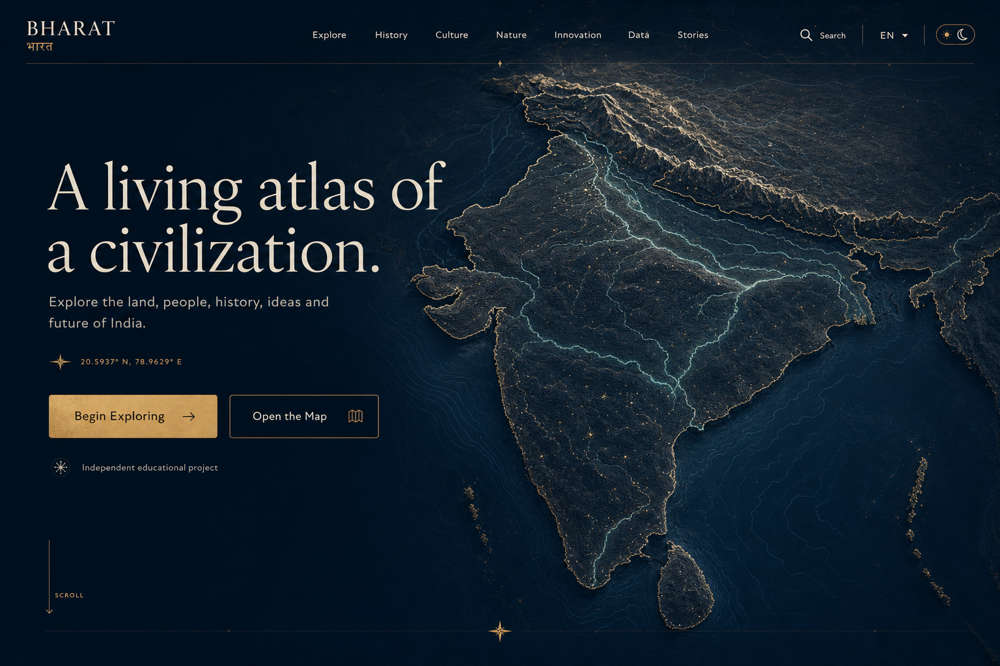

<p align="center">
  
</p>

<h1 align="center">BHARAT · भारत</h1>

<p align="center">
  <strong>A living atlas of a civilization.</strong><br />
  Explore the land, people, history, ideas and future of India.
</p>

<p align="center">
  <a href="https://atlas-bharat.vercel.app"></a>
  <a href="docs/concepts/CONCEPT_SYSTEM.md"></a>
</p>

<p align="center">
  
  
  
  
</p>

---

BHARAT is an independent, evidence-led digital atlas and knowledge platform about India. It combines the depth of an encyclopedia, the freedom of an atlas, the storytelling rhythm of a digital museum and the legibility of a modern data platform.

It is designed around one idea: **ancient depth, modern precision**. The interface is monumental without being loud, distinctly Indian without becoming ornamental shorthand, and cinematic without delaying navigation or reading.

> [!IMPORTANT]
> BHARAT is an independent educational project. It is not affiliated with the Government of India and does not present itself as an official service.

## The experience

- A full-viewport, procedural topographic hero built from real administrative geometry
- An interactive MapLibre atlas with state selection, layers, search, keyboard/touch alternatives and linked state profiles
- An uncertainty-aware historical chronology from early settlements to contemporary India
- Editorial collections for culture, physical geography and innovation
- Accessible data comparisons with units, reference years, review dates, methodology notes and table equivalents
- Six structured long-form stories using reusable prose, map, timeline, quote and data blocks
- Typo-tolerant global search with previews, keyboard shortcut and recent-search persistence
- Complete demonstration atlases for **Odisha**, **Rajasthan** and **Kerala**
- Dark and light themes, responsive composition and a full reduced-motion mode

## A small tour

| Explore | Understand | Follow a story |
|---|---|---|
| Move from the national atlas to a selected state. | See the source, date and interpretive limits behind a chart or historical event. | Read one question across prose, maps, timelines and evidence. |
| [/explore](https://atlas-bharat.vercel.app/explore) | [/methodology](https://atlas-bharat.vercel.app/methodology) | [/stories](https://atlas-bharat.vercel.app/stories) |

## Information architecture

```text
/
├── explore
├── states
│   └── [slug]         Odisha · Rajasthan · Kerala
├── places/[slug]
├── history
│   └── timeline
├── culture
├── nature
├── innovation
│   └── space
├── data
├── stories
│   └── [slug]
├── search
├── sources
├── methodology
└── about
```

Every path is server-rendered where possible. WebGL, MapLibre and heavier interactive modules stay outside routes that do not need them.

## Engineering

BHARAT uses Next.js App Router, React Server Components, strict TypeScript and Tailwind CSS with a focused cinematic CSS layer. React Three Fiber and Drei own the hero scene; MapLibre owns geographic interaction; Zod owns content validation; Fuse powers the replaceable local search index.

```text
app/          routes, metadata, sitemap and social image
components/   shell, hero, map, data and search systems
content/      states, places, history, stories, datasets and sources
lib/          schemas, validated indexes and site configuration
public/data/  licensed administrative geometry
scripts/      content, source and route validators
tests/        Vitest and Testing Library coverage
e2e/          Playwright desktop and mobile journeys
docs/         concept, architecture, accessibility and QA records
```

### Run locally

```bash
corepack enable
pnpm install
pnpm dev
```

Open `http://localhost:3000`.

### Release gates

```bash
pnpm qa
pnpm test:e2e
```

`pnpm qa` runs lint, strict type-checking, unit/component tests, content-schema validation, source-reference validation, internal route checks and the production build.

## Truth and attribution

Content records reference stable IDs in a central source registry rather than copying raw URLs. Meaningful facts can carry:

- one or more sources
- a reference year
- a review date
- a confidence classification
- an optional methodological note

The Phase 1 registry prioritises Census of India, state institutions, ISRO, UNESCO, NCERT, IMD and the Central Water Commission. Administrative geometry is supplied through geoBoundaries and retains its source/licence note in both the registry and map attribution.

See the [source and attribution policy](docs/content/SOURCE_AND_ATTRIBUTION_POLICY.md), [methodology](https://atlas-bharat.vercel.app/methodology) and [content contribution guide](docs/CONTENT_CONTRIBUTION.md).

## Accessibility and performance

The site targets WCAG AA. Maps and charts have textual alternatives; navigation, search and menus work by keyboard; status never relies only on colour; focus is visible; and mobile is separately composed.

When reduced motion is requested, the entry sequence, parallax, ambient particles and WebGL scene are removed while all content and navigation remain. The map and terrain systems are dynamically imported, distant homepage sections use `content-visibility`, and visual effects are constrained to composited motion.

- [Accessibility notes](docs/ACCESSIBILITY.md)
- [Performance architecture and budgets](docs/PERFORMANCE.md)
- [Motion architecture](docs/design/MOTION_ARCHITECTURE.md)
- [Release QA and fidelity ledger](docs/QA_REPORT.md)

## Design archive

The production experience grew from eleven approved high-resolution plates covering the hero, atlas, timeline, cultural tapestry, nature, innovation, data, stories, sources, state template and mobile system.

[Open the complete visual concept system →](docs/concepts/CONCEPT_SYSTEM.md)

## Contributing

Please start with [CONTENT_CONTRIBUTION.md](docs/CONTENT_CONTRIBUTION.md). New records are expected to be sourced, reviewed, schema-valid and considerate of script accuracy, licensing and uncertainty.

---

<p align="center">
  <strong>BHARAT · भारत</strong><br />
  <sub>Evidence-led. Openly attributed. Built with care.</sub>
</p>
