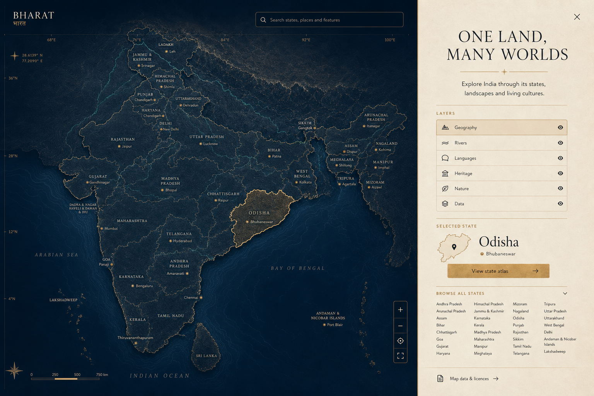
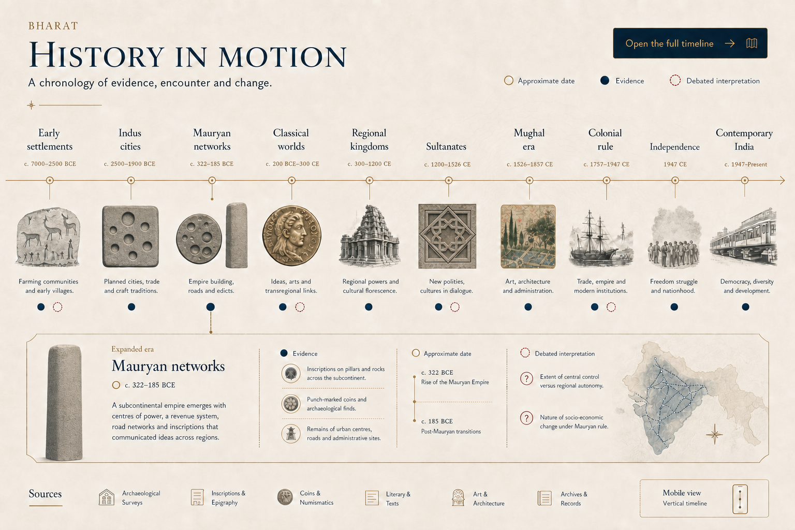
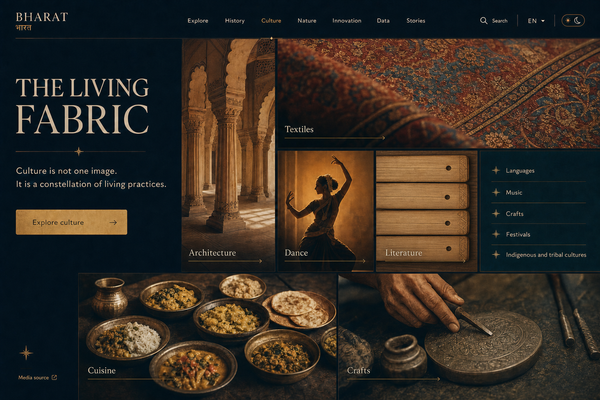
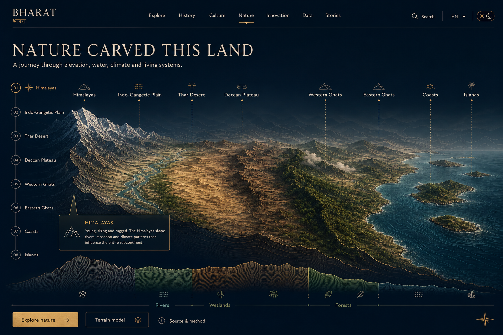
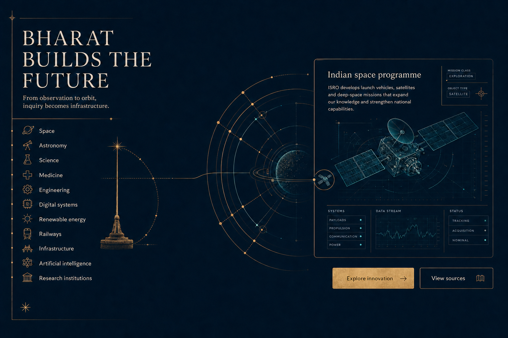
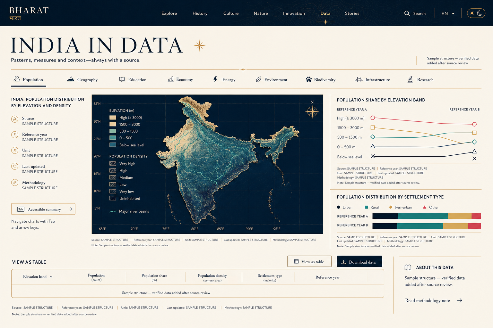
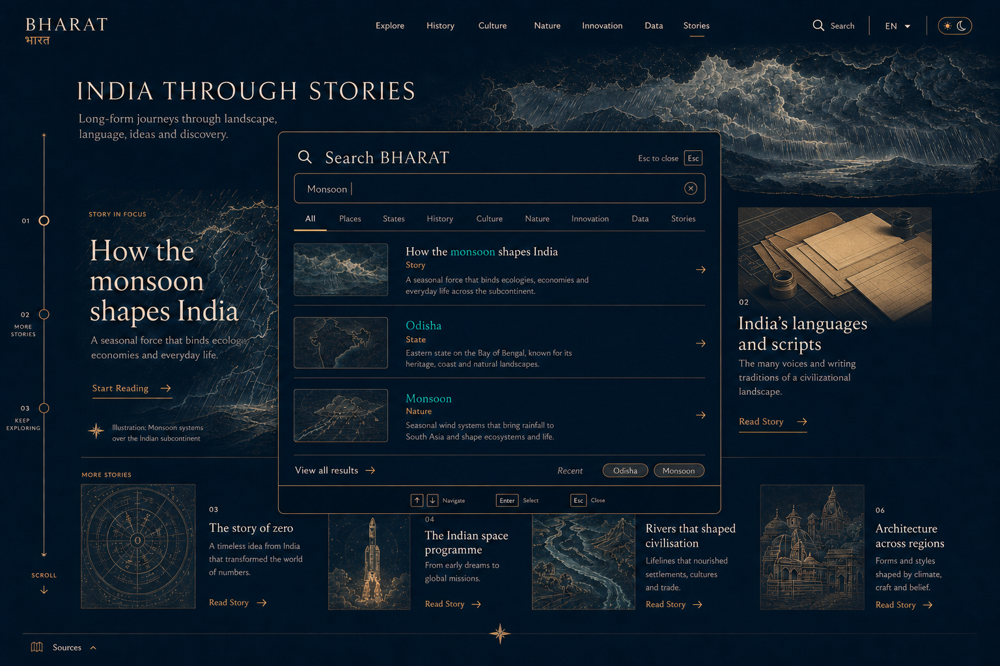
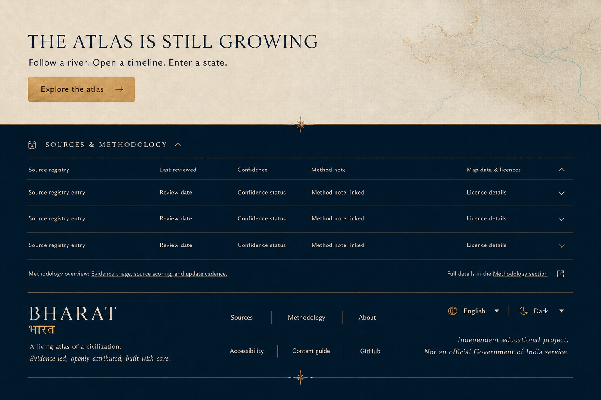
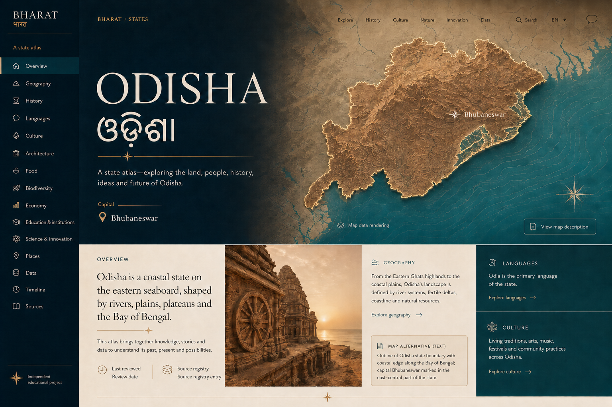
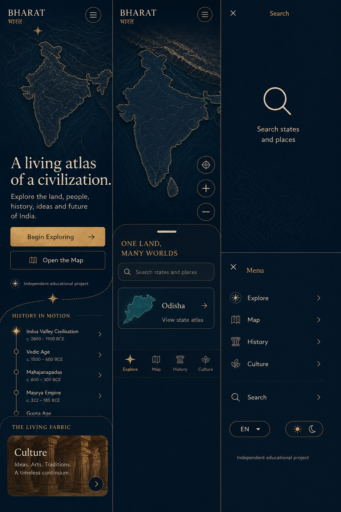

# BHARAT visual concept system

## Approval candidate

**Direction:** Atlas of Quiet Magnitude  
**Design philosophy:** Ancient depth, modern precision  
**Brand line:** A living atlas of a civilization.

This package is the visual and interaction specification for production. It deliberately avoids a single compressed full-page mockup: each major surface has its own high-resolution plate so layout, hierarchy, interaction and responsive behaviour can be evaluated independently.

> These plates define design intent, not factual evidence. Generated terrain, maps, dates, diagrams and editorial media are not production data or licensed publication assets. Production must use validated geospatial boundaries, reviewed content, registered sources, and attributable media.

## Visual constitution

- Monumental editorial typography against quiet, high-information surfaces.
- Midnight cartography alternates with warm archival paper to create page rhythm.
- Fine brass rules behave like coordinates, measurement marks and annotation paths.
- Sandstone, teal, forest and crimson are semantic accents, not decorative gradients.
- Topographic contour, river and orbital lines form a shared visual grammar.
- Layouts use seams, rails, fields and editorial spreads instead of repeated cards.
- Motion clarifies geographic scale, chronology, narrative focus and state changes.
- Sources, review status and alternatives remain visible at the point of use.

## 01 · Navigation and hero

**Production intent**

- One-second, non-blocking contour entry; shortened after first visit.
- Minimal navigation over a static server-rendered first frame.
- Dynamically loaded terrain becomes interactive after essential content is ready.
- Copy remains stable and readable while the scene responds within strict limits.
- “Begin Exploring” scrolls to the explorer; “Open the Map” routes to `/explore`.
- WebGL failure and reduced motion use the same static topographic composition.

## 02 · Interactive India explorer

**Production intent**

- Map occupies the spatial field; a persistent editorial rail explains selection.
- Search, state list, capital markers, layer switches and direct state links all work.
- Pointer, keyboard, touch and textual fallback are equal entry modes.
- Boundaries and labels come only from reviewed, licensed geospatial sources.
- Selected state uses shape, outline, label and information rail—not colour alone.

## 03 · History in motion

**Production intent**

- Spatial horizontal chronology on desktop; semantic vertical chronology on mobile.
- Evidence, approximate dating and debated interpretation have distinct markers.
- Expanded-era detail holds sources, uncertainty and deep links beside the narrative.
- The timeline is navigable by era, arrow keys, landmark list and URL fragment.

## 04 · The living fabric

**Production intent**

- Asymmetric editorial tapestry with intentionally varied media scale and rhythm.
- Categories open real culture routes or filtered views; no decorative tile is inert.
- Media always exposes source/attribution and culturally specific context.
- Indian scripts appear only from reviewed Unicode content in script-appropriate fonts.

## 05 · Nature carved this land

**Production intent**

- Geographic transect explains elevation, water and ecosystems without pretending the land is one literal cross-section.
- Chapter rail, terrain model, text summary and source method are directly accessible.
- Off-screen terrain pauses; mobile uses simplified geometry and static layered imagery.
- No unsupported biodiversity, climate or elevation numbers enter the interface.

## 06 · Bharat builds the future

**Production intent**

- One signature line transforms from astronomical measurement to orbit to interface.
- The line choreography is the only GSAP-class sequence proposed for the homepage.
- Each discipline is an editorial chapter, not a dashboard tile.
- Claims and programme descriptions resolve to institution or research sources.

## 07 · India in data

**Production intent**

- A dominant chart answers one question; supporting charts add comparison and context.
- Every chart includes source, year, unit, update date and methodology.
- Pattern, symbols and direct labels supplement colour.
- Keyboard exploration, accessible summaries and table equivalents are always present.
- The plate intentionally uses `SAMPLE STRUCTURE` instead of fabricated values.

## 08 · India through stories + Search BHARAT

**Production intent**

- Reusable story engine supports media, maps, timelines, quotes, data, comparisons, sticky chapters, footnotes and source panels.
- Search opens from navigation, `/`, `Ctrl/Cmd+K`, and a dedicated route.
- Local Phase 1 index supports typo tolerance, category filtering, previews and recent searches.
- Dialog focus is trapped and restored; mobile search becomes a full-screen route.

## 09 · Footer, sources and methodology

**Production intent**

- Sources and methodology are part of the page cadence, not a legal afterthought.
- Source records expose registry reference, review date, confidence, method and licence.
- The concept uses neutral field labels—no source IDs, dates or licences are invented.
- The independent-project disclaimer remains visible throughout the product.

## 10 · Odisha state-detail template

**Production intent**

- Reusable template with state-specific atmosphere inside one coherent system.
- English and reviewed regional-script names receive equal typographic care.
- Geographic silhouette includes a textual description and licensed source metadata.
- Chapter navigation supports overview, geography, history, language, culture, architecture, food, biodiversity, economy, education, innovation, places, data, timeline and sources.
- Odisha, Rajasthan and Kerala are the proposed Phase 1 demonstration states, subject to content-source review.

## 11 · Mobile homepage

**Production intent**

- A separately composed mobile experience, not compressed desktop.
- Static terrain first; map interaction opens into a touch-first bottom sheet.
- Timeline becomes vertical and culture becomes a single editorial seam.
- Search and menu are full-screen, safe-area aware and comfortably touch sized.
- No horizontal overflow, hover dependency or ambient particle loop.

## Component families

| Family | Purpose | Primary forms |
| --- | --- | --- |
| Atlas shell | Navigation, themes, language, skip links | Header rail, mobile menu, command search |
| Cartography | Geographic exploration | Map field, layer rail, state panel, textual fallback |
| Chronology | History and state timelines | Era axis, uncertainty marker, evidence drawer |
| Editorial media | Culture and stories | Media seam, caption, attribution, footnotes |
| Terrain | Hero and nature | Static poster, WebGL scene, transect, fallback summary |
| Scientific line | Innovation narrative | Measurement line, orbit path, instrument panel |
| Data studio | Accessible visualisation | Chart, legend, metadata rail, summary, table |
| Evidence | Trust and provenance | Source record, confidence status, review stamp, method note |

## Concept acceptance checklist

Approval means agreement on:

- the midnight/ivory editorial rhythm;
- the restrained brass cartographic line language;
- the typography scale and calm information density;
- the map-plus-editorial-rail interaction model;
- the horizontal/vertical history model;
- the asymmetric culture and story layouts;
- the single astronomy-to-orbit signature transition;
- the data provenance treatment;
- the state-page composition;
- the simplified, mobile-first terrain and navigation treatment.

Implementation does not begin until this system is approved or revised.
